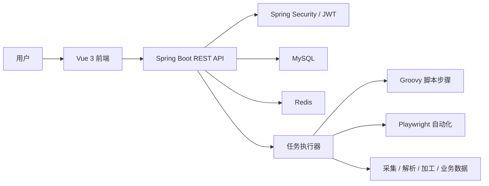

# RPA 管理平台

> 面向 RPA 业务流程、机器人、任务执行与数据处理的一体化管理系统。

仓库地址：[https://github.com/Nyx-Amanises/RPA](https://github.com/Nyx-Amanises/RPA)

## 项目简介

RPA 管理平台由 Spring Boot 后端和 Vue 3 前端组成，提供账号认证、权限控制、流程管理、机器人管理、任务调度、执行记录、日志追踪、数据采集、数据解析、数据加工与业务数据查询等功能。

系统适合用于 RPA 流程管理、自动化任务执行结果跟踪、业务数据处理链路展示，以及基于角色的后台权限管理场景。

## 功能特性

- 统一认证：基于 JWT 的登录认证、当前用户信息获取与前端路由守卫。
- 权限管理：用户、角色、资源菜单、权限标识和页面级访问控制。
- RPA 资源管理：机器人列表、流程列表、流程步骤、任务列表与任务执行。
- 执行追踪：执行记录查询、执行详情、执行日志流式输出。
- 数据链路：数据采集、数据解析、数据加工、最终业务数据查询。
- 可视化首页：任务统计、状态分布、机器人运行概览和最近任务。
- 自动化执行：后端集成 Groovy 与 Playwright，支持按流程步骤执行自动化逻辑。
- 接口文档：集成 springdoc-openapi，可通过 Swagger UI 查看后端接口。

## 技术栈

| 模块 | 技术 |
| --- | --- |
| 后端 | Java 17, Spring Boot 4, Spring Security, Spring Data JPA, Bean Validation |
| 数据库 | MySQL, Redis |
| 自动化 | Groovy, Playwright Java |
| 接口文档 | springdoc-openapi / Swagger UI |
| 前端 | Vue 3, Vite, Pinia, Vue Router, Element Plus, Axios |
| 构建工具 | Maven, npm |

## 项目结构

```text
RPA/
├── src/main/java/com/rpa/manage/      # Spring Boot 后端源码
│   ├── controller/                    # REST 接口
│   ├── service/                       # 业务服务
│   ├── domain/                        # DTO、Entity、Repository
│   ├── security/                      # JWT、权限与安全配置
│   └── config/                        # OpenAPI、文件访问、线程池等配置
├── src/main/resources/
│   ├── application.yml                # 后端配置
│   └── static/                        # 静态测试页面
├── RPA-vue/                           # Vue 前端项目
│   ├── src/api/                       # 接口封装
│   ├── src/router/                    # 路由与权限守卫
│   ├── src/stores/                    # Pinia 状态管理
│   ├── src/views/                     # 页面视图
│   └── src/mock/                      # 前端 mock 数据
├── docs/images/                       # README 截图资源
├── rpa_manage_db.sql                  # 数据库初始化脚本
└── pom.xml                            # Maven 配置
```

## 系统架构



## 页面预览

### 登录与首页


### 系统管理

| 用户管理 | 角色管理 |
| --- | --- |
|  |  |

| 资源管理 | 个人信息 |
| --- | --- |
|  |  |

### RPA 管理

| 任务列表 | 执行记录 |
| --- | --- |
|  |  |

| 机器人列表 | 流程列表 |
| --- | --- |
|  |  |

### 数据链路

| 数据采集 | 数据解析 |
| --- | --- |
|  |  |

| 数据加工 | 业务数据 |
| --- | --- |
|  |  |

## 环境要求

- JDK 17+
- Maven 3.9+
- Node.js 18+，npm 9+
- MySQL 8+
- Redis 6+

## 后端启动

1. 创建数据库：

```sql
CREATE DATABASE rpa_manage_db
  DEFAULT CHARACTER SET utf8mb4
  COLLATE utf8mb4_unicode_ci;
```

2. 导入初始化数据：

```bash
mysql -u root -p rpa_manage_db < rpa_manage_db.sql
```

3. 按本地环境修改 [application.yml](src/main/resources/application.yml)：

```yaml
spring:
  datasource:
    url: jdbc:mysql://localhost:3306/rpa_manage_db?useUnicode=true&characterEncoding=UTF-8&serverTimezone=Asia/Shanghai&allowPublicKeyRetrieval=true&useSSL=false
    username: root
    password: 你的数据库密码
  data:
    redis:
      host: localhost
      port: 6379
```

4. 启动后端：

```bash
mvn spring-boot:run
```

后端默认地址：

- API 服务：http://localhost:8080
- Swagger UI：http://localhost:8080/swagger-ui.html
- OpenAPI JSON：http://localhost:8080/v3/api-docs

## 前端启动

进入前端目录：

```bash
cd RPA-vue
npm install
```

连接后端开发模式：

```bash
npm run dev
```

使用 mock 数据开发：

```bash
npm run dev:mock
```

生产构建：

```bash
npm run build
```

前端默认地址：http://localhost:5173

开发代理配置位于 [vite.config.js](RPA-vue/vite.config.js)，默认通过 `.env.dev` 将 `/api` 和 `/uploads` 转发到 `http://127.0.0.1:8080`。

## 默认账号

导入 `rpa_manage_db.sql` 后，可使用初始化账号登录：

```text
用户名：admin
密码：123456
```

如果使用 `npm run dev:mock`，前端会使用 mock 登录数据，适合只调试界面。

## 主要接口模块

| 模块 | 路径 |
| --- | --- |
| 登录认证 | `/api/v1/auth` |
| 首页统计 | `/api/v1/dashboard` |
| 用户管理 | `/api/v1/users` |
| 角色管理 | `/api/v1/roles` |
| 资源管理 | `/api/v1/resources` |
| 机器人管理 | `/api/v1/robots` |
| 流程管理 | `/api/v1/processes` |
| 任务管理 | `/api/v1/tasks` |
| 执行记录 | `/api/v1/executions` |
| 数据采集 | `/api/v1/data-collection` |
| 数据解析 | `/api/v1/data-analysis` |
| 数据加工 | `/api/v1/data-processing` |
| 业务数据 | `/api/v1/business-data` |

## 开发说明

- 前端权限由路由 `meta.permission`、用户权限标识和自定义权限指令共同控制。
- 后端接口通过 `@PreAuthorize` 校验权限，权限标识与资源表配置保持一致。
- 任务执行采用异步线程池，流程步骤可执行 Groovy 脚本，并可注入 Playwright 页面对象完成自动化采集。
- 上传头像默认保存到 `uploads/avatars`，该目录属于运行时数据，不建议提交到仓库。
- `application.yml` 中的数据库密码和 JWT secret 仅适合作为本地开发示例，生产部署时应改为环境变量或外部配置。

## 常用命令

```bash
# 后端编译
mvn -DskipTests compile

# 后端启动
mvn spring-boot:run

# 前端开发
cd RPA-vue
npm run dev

# 前端 mock 模式
npm run dev:mock

# 前端构建
npm run build
```

