# RPA 管理平台

> 面向 RPA 业务流程、机器人、任务执行与数据处理的一体化管理系统。

仓库地址：[https://github.com/Nyx-Amanises/RPA](https://github.com/Nyx-Amanises/RPA)

## 项目简介

RPA 管理平台由 Spring Boot 后端和 Vue 3 前端组成，提供账号认证、权限控制、流程管理、机器人管理、任务调度、执行记录、日志追踪、数据采集、数据解析、数据加工与业务数据查询等功能。

系统适合用于 RPA 流程管理、自动化任务执行结果跟踪、业务数据处理链路展示，以及基于角色的后台权限管理场景。

## 功能特性

- 统一认证：基于 JWT 的登录认证、当前用户信息获取与前端路由守卫。
- 权限管理：用户、角色、资源菜单、权限标识和页面级访问控制。
- RPA 资源管理：机器人列表、流程列表、流程步骤、任务列表与任务执行。
- 执行追踪：执行记录查询、执行详情、执行日志流式输出。
- 数据链路：数据采集、数据解析、数据加工、最终业务数据查询。
- 指标管理：支持指标定义、受限公式计算、最近结果展示和同企业/同批次结果选择。
- 指标额度计算：支持多指标组合、判断分支、默认分支、额度公式和输出 JSON 模板。
- AI Agent 辅助：支持自然语言生成公式草稿、公式引用检查、额度结果解释和 AI 额度计算编排。
- AI 模型配置：支持 DeepSeek、豆包/火山方舟、OpenAI 及自定义兼容接口配置，并保存模型参数。
- 测试数据站点：提供本地 mock 税务/授信测试站点和可复制 Groovy 脚本，用于演示采集到指标计算的完整链路。
- 可视化首页：任务统计、状态分布、机器人运行概览和最近任务。
- 自动化执行：后端集成 Groovy 与 Playwright，支持按流程步骤执行自动化逻辑。
- 接口文档：集成 springdoc-openapi，可通过 Swagger UI 查看后端接口。

## 技术栈

| 模块 | 技术 |
| --- | --- |
| 后端 | Java 17, Spring Boot 4, Spring Security, Spring Data JPA, Bean Validation |
| 数据库 | MySQL, Redis |
| 自动化 | Groovy, Playwright Java |
| 接口文档 | springdoc-openapi / Swagger UI |
| 前端 | Vue 3, Vite, Pinia, Vue Router, Element Plus, Axios |
| 构建工具 | Maven, npm |

## 项目结构

```text
RPA/
├── src/main/java/com/rpa/manage/      # Spring Boot 后端源码
│   ├── controller/                    # REST 接口
│   ├── service/                       # 业务服务
│   ├── domain/                        # DTO、Entity、Repository
│   ├── security/                      # JWT、权限与安全配置
│   └── config/                        # OpenAPI、文件访问、线程池等配置
├── src/main/resources/
│   ├── application.yml                # 后端配置
│   └── static/                        # 静态测试页面
├── RPA-vue/                           # Vue 前端项目
│   ├── src/api/                       # 接口封装
│   ├── src/router/                    # 路由与权限守卫
│   ├── src/stores/                    # Pinia 状态管理
│   ├── src/views/                     # 页面视图
│   └── src/mock/                      # 前端 mock 数据
├── mock-tax-site/                     # 本地税务/授信测试站点与 RPA 脚本
├── docs/images/                       # README 截图资源
├── rpa_manage_db.sql                  # 数据库初始化脚本
└── pom.xml                            # Maven 配置
```

## 系统架构

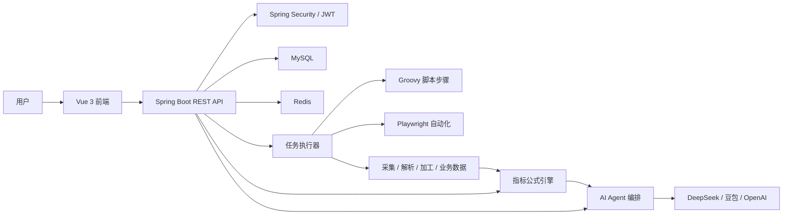

## 指标管理与 AI Agent

### 指标计算

指标计算用于把 RPA 任务采集、解析、加工后的业务数据转换为可复用指标。每个指标包含：

- 指标名称和指标编码，例如 `TAX_RATE`、`PROFIT_RATE`。
- 结果变量名，例如 `taxRate`、`profitRate`。
- 展示用指标逻辑说明。
- 后端可执行的受限公式，例如 `TAX_RATE = taxPayable / taxRevenue`。
- 数据来源任务 ID，对应 `rpa_task.id`。

指标计算会读取绑定任务最近一次执行成功的数据，并将结果写入 `indicator_result`。

### 指标额度计算

指标额度计算用于把多个指标组合成额度或评级结果。每条额度规则包含：

- 关联指标列表。
- 多个判断分支，从上到下匹配。
- 每个分支对应的额度计算公式。
- 默认分支。
- 输出数据模板，例如包含 `${creditLimit}`、`${riskScore}` 的 JSON 模板。

手动点击“计算”时，系统仍由后端受限公式引擎完成确定性计算，保证同一组数据和规则可以复现相同结果。

### AI 辅助

AI 辅助页面提供四类能力：

- 自然语言转公式：把“根据净利润和营业收入计算利润率”转成公式草稿。
- 检查公式引用：检查公式中是否引用了不存在的指标或变量。
- 解释额度结果：根据用户提供的规则和上下文解释额度结果。
- AI 额度计算：Agent 读取额度规则，自动补算关联指标，调用额度计算工具，并生成执行步骤和解释。

AI Agent 不直接生成额度金额。额度金额仍由后端公式引擎计算，AI 负责流程编排、上下文组织和结果解释。

### 模型配置

AI 模型配置保存在 `ai_model_config` 表中，前端刷新后会自动读取。当前支持：

- DeepSeek Chat Completions
- 豆包/火山方舟 Chat Completions
- 豆包/火山方舟 Responses
- OpenAI Chat Completions
- 自定义兼容接口

保存后，前端不会明文回显 API Key，只显示是否已保存。课程或本地测试场景可直接使用该方式；正式部署建议改为加密存储或外部密钥管理。

## 本地测试站点

仓库内提供 `mock-tax-site`，用于在原测试网站不可用时模拟税务、发票、财务、风险和授信页面。

启动方式：

```bash
cd mock-tax-site
python -m http.server 18010
```

访问地址示例：

```text
http://127.0.0.1:18010/spider/#/enterprise-info
http://127.0.0.1:18010/spider/#/invoice-query
http://127.0.0.1:18010/spider/#/financial-report
http://127.0.0.1:18010/spider/#/risk-info
```

可复制的 RPA 脚本位于 `mock-tax-site/rpa-scripts/`，用于演示：

1. 采集 mock 站点业务源数据。
2. 解析业务源数据。
3. 预处理指标变量。
4. 保存最终业务结果。

## 页面预览

### 登录与首页

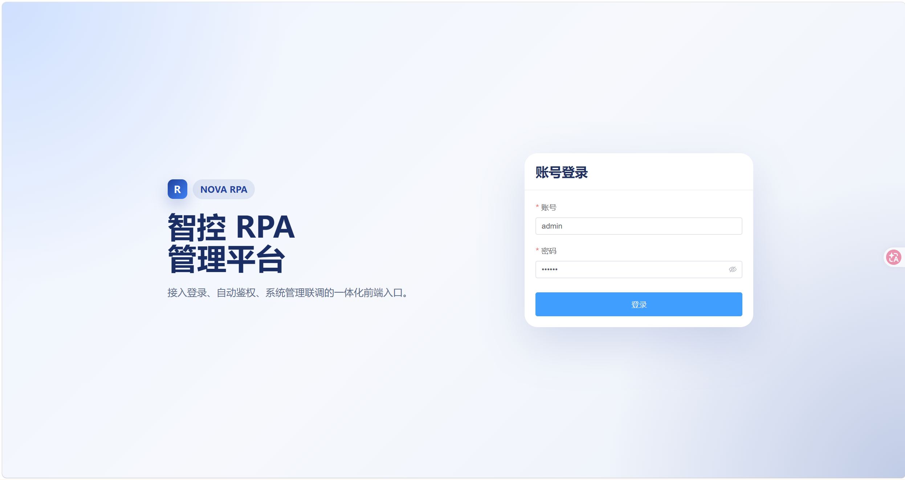

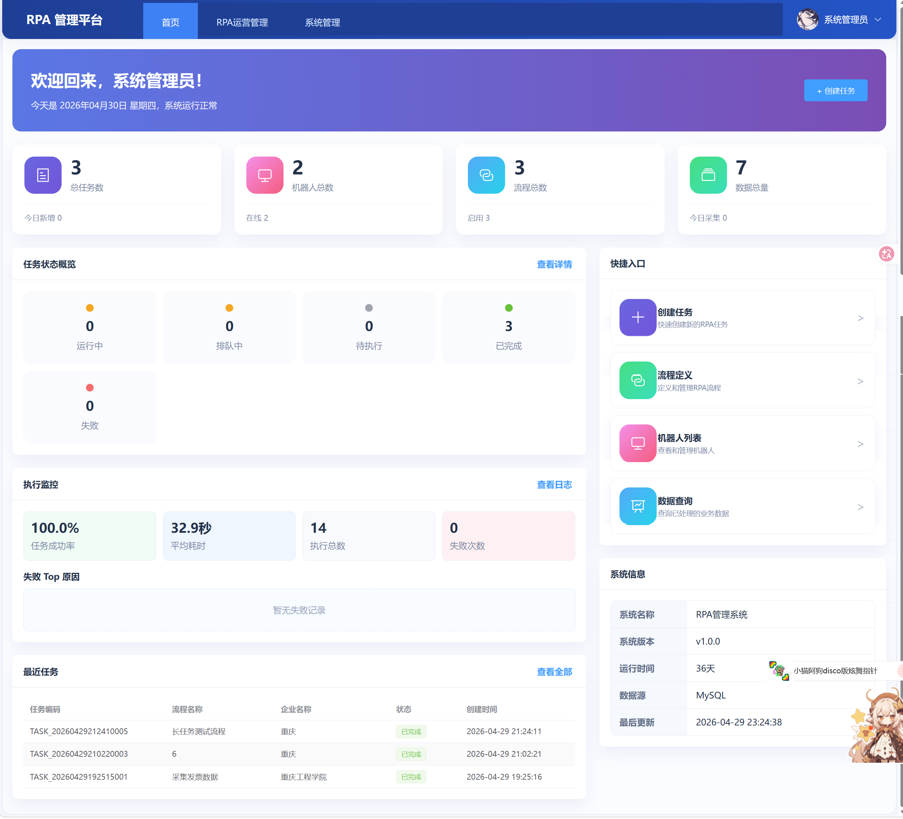

### 系统管理

| 用户管理 | 角色管理 |
| --- | --- |
| 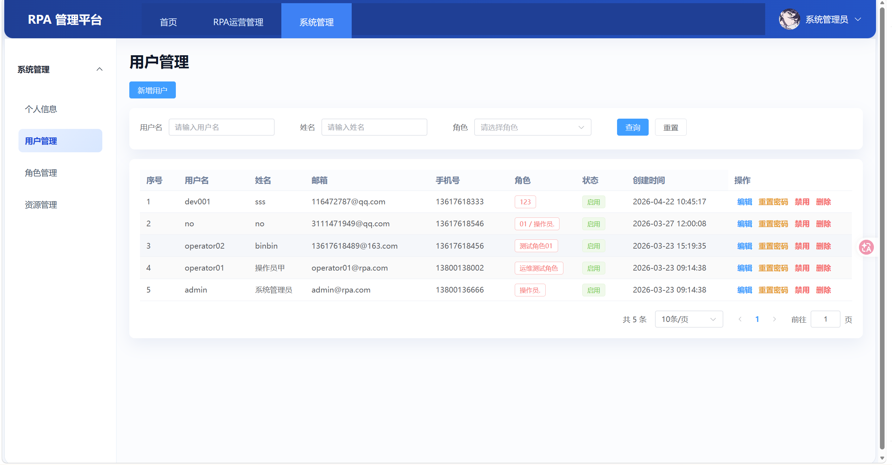 | 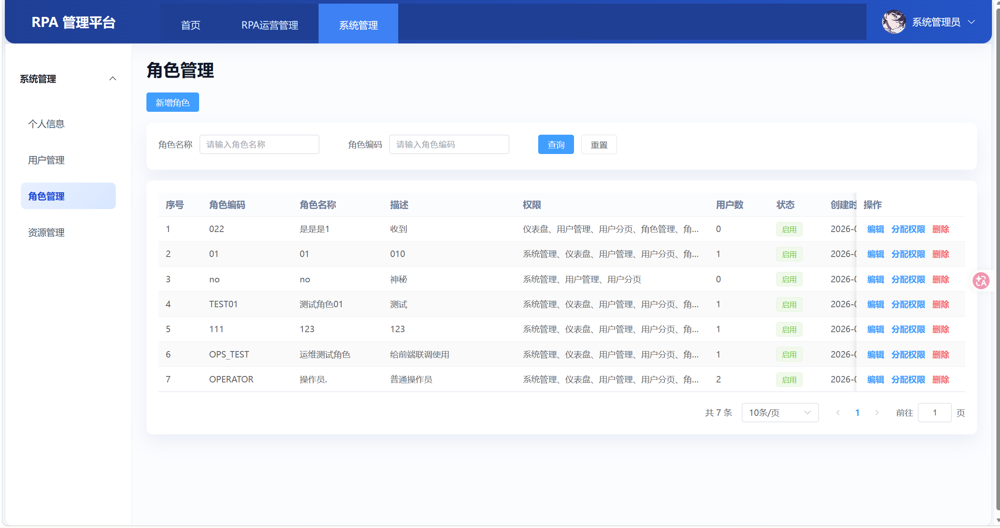 |

| 资源管理 | 个人信息 |
| --- | --- |
| 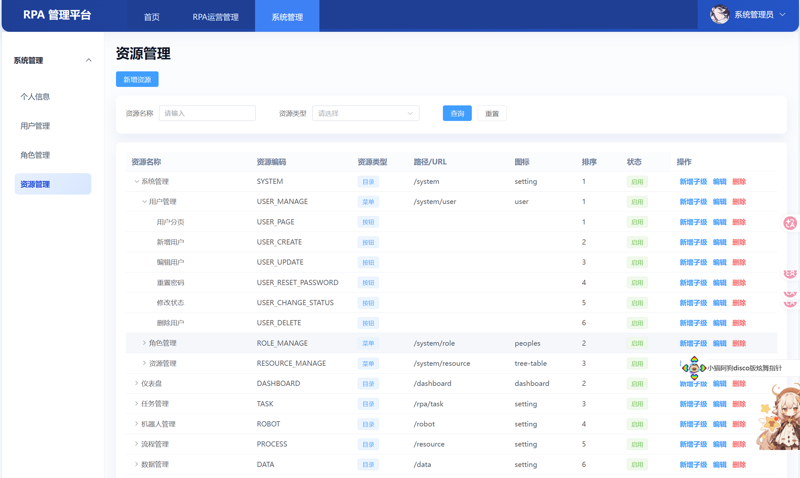 | 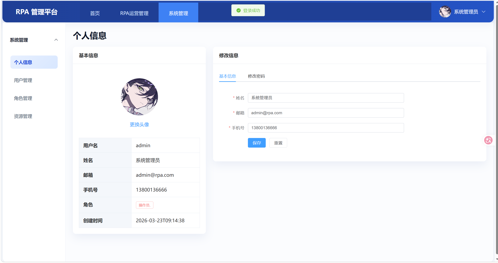 |

### RPA 管理

| 任务列表 | 执行记录 |
| --- | --- |
| 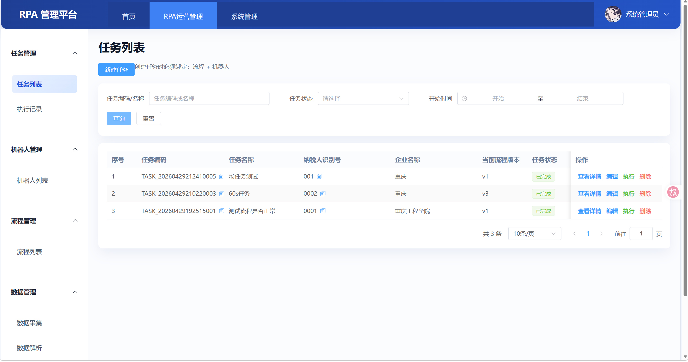 | 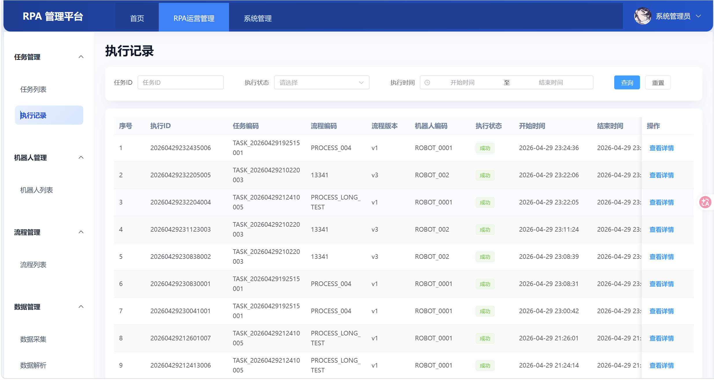 |

| 机器人列表 | 流程列表 |
| --- | --- |
| 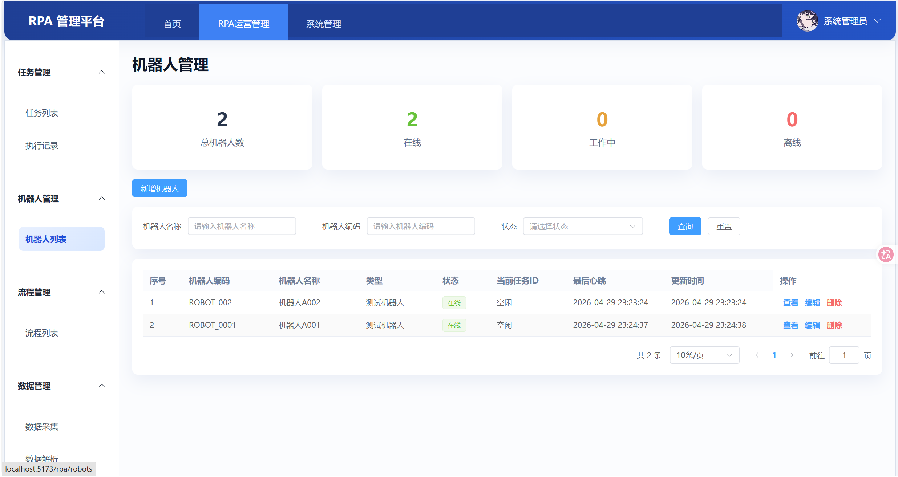 | 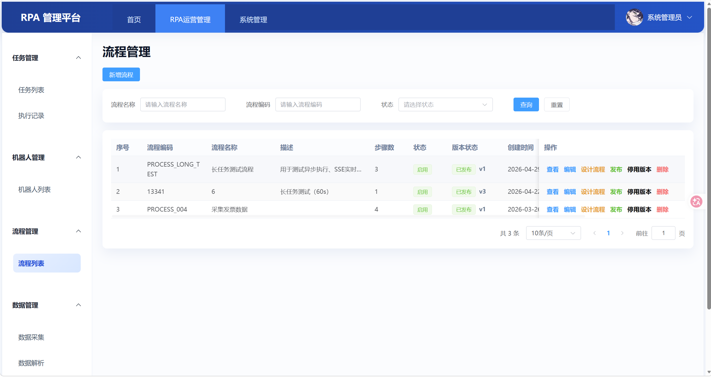 |

### 数据链路

| 数据采集 | 数据解析 |
| --- | --- |
| 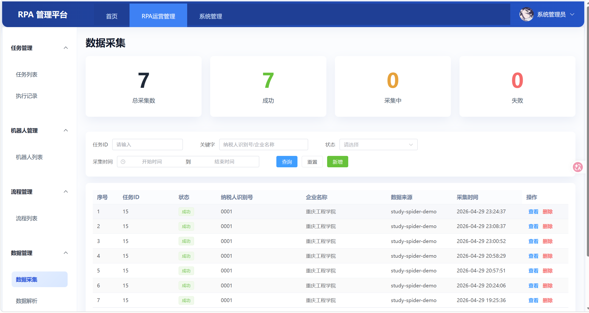 | 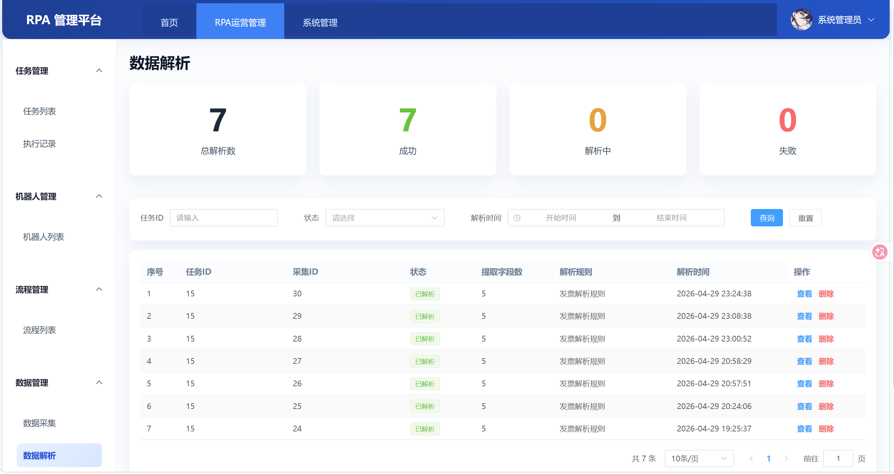 |

| 数据加工 | 业务数据 |
| --- | --- |
| 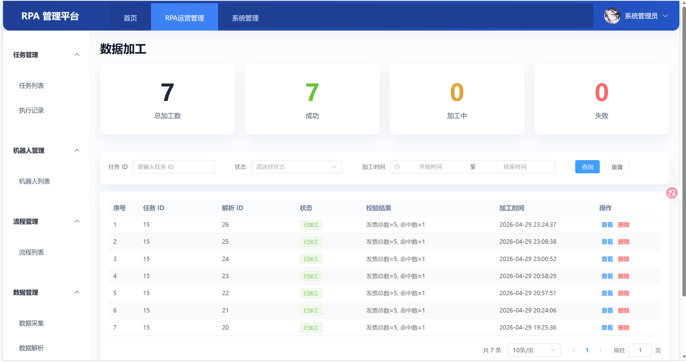 | 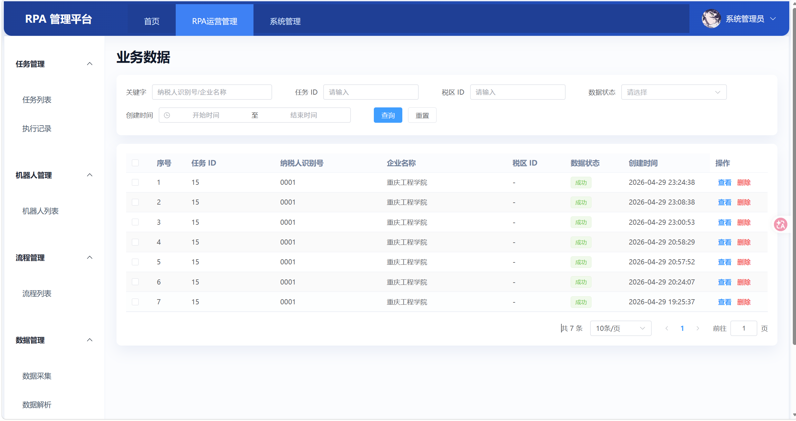 |

## 环境要求

- JDK 17+
- Maven 3.9+
- Node.js 18+，npm 9+
- MySQL 8+
- Redis 6+

## 后端启动

1. 创建数据库：

```sql
CREATE DATABASE rpa_manage_db
  DEFAULT CHARACTER SET utf8mb4
  COLLATE utf8mb4_unicode_ci;
```

2. 导入初始化数据：

```bash
mysql -u root -p rpa_manage_db < rpa_manage_db.sql
```

3. 按本地环境修改 [application.yml](src/main/resources/application.yml)：

```yaml
spring:
  datasource:
    url: jdbc:mysql://localhost:3306/rpa_manage_db?useUnicode=true&characterEncoding=UTF-8&serverTimezone=Asia/Shanghai&allowPublicKeyRetrieval=true&useSSL=false
    username: root
    password: 你的数据库密码
  data:
    redis:
      host: localhost
      port: 6379
```

4. 启动后端：

```bash
mvn spring-boot:run
```

后端默认地址：

- API 服务：http://localhost:8080
- Swagger UI：http://localhost:8080/swagger-ui.html
- OpenAPI JSON：http://localhost:8080/v3/api-docs

## 前端启动

进入前端目录：

```bash
cd RPA-vue
npm install
```

连接后端开发模式：

```bash
npm run dev
```

使用 mock 数据开发：

```bash
npm run dev:mock
```

生产构建：

```bash
npm run build
```

前端默认地址：http://localhost:5173

开发代理配置位于 [vite.config.js](RPA-vue/vite.config.js)，默认通过 `.env.dev` 将 `/api` 和 `/uploads` 转发到 `http://127.0.0.1:8080`。

## 默认账号

导入 `rpa_manage_db.sql` 后，可使用初始化账号登录：

```text
用户名：admin
密码：123456
```

如果使用 `npm run dev:mock`，前端会使用 mock 登录数据，适合只调试界面。

## 主要接口模块

| 模块 | 路径 |
| --- | --- |
| 登录认证 | `/api/v1/auth` |
| 首页统计 | `/api/v1/dashboard` |
| 用户管理 | `/api/v1/users` |
| 角色管理 | `/api/v1/roles` |
| 资源管理 | `/api/v1/resources` |
| 机器人管理 | `/api/v1/robots` |
| 流程管理 | `/api/v1/processes` |
| 任务管理 | `/api/v1/tasks` |
| 执行记录 | `/api/v1/executions` |
| 数据采集 | `/api/v1/data-collection` |
| 数据解析 | `/api/v1/data-analysis` |
| 数据加工 | `/api/v1/data-processing` |
| 业务数据 | `/api/v1/business-data` |
| 指标计算 | `/api/v1/indicators` |
| 指标额度计算 | `/api/v1/indicator-quotas` |
| AI Agent 辅助 | `/api/v1/agent-assist` |

## 开发说明

- 前端权限由路由 `meta.permission`、用户权限标识和自定义权限指令共同控制。
- 后端接口通过 `@PreAuthorize` 校验权限，权限标识与资源表配置保持一致。
- 任务执行采用异步线程池，流程步骤可执行 Groovy 脚本，并可注入 Playwright 页面对象完成自动化采集。
- 指标公式和额度公式使用后端受限公式引擎执行，不建议把额度金额交给外部模型直接生成。
- AI Agent 目前作为编排层使用，负责补算指标、调用额度计算工具和生成解释。
- 上传头像默认保存到 `uploads/avatars`，该目录属于运行时数据，不建议提交到仓库。
- `application.yml` 中的数据库密码和 JWT secret 仅适合作为本地开发示例，生产部署时应改为环境变量或外部配置。

## 常用命令

```bash
# 后端编译
mvn -DskipTests compile

# 后端启动
mvn spring-boot:run

# 前端开发
cd RPA-vue
npm run dev

# 前端 mock 模式
npm run dev:mock

# 前端构建
npm run build
```

## 后续规划

- 自然语言额度计算：用户输入“给某企业计算经营授信额度”，Agent 自动匹配额度规则并执行。
- Agent 工具化增强：将“查询企业数据、查询指标结果、补算指标、额度计算、结果解释”拆成更清晰的工具调用步骤。
- 额度结果详情页：展示命中分支、变量代入、指标来源批次和 AI 解释，减少手动复制上下文。
- 指标版本管理：记录指标公式和额度规则版本，保证历史结果可追溯。
- 指标结果批次选择：支持用户在页面上明确选择企业、任务执行批次或最近完整指标组。
- AI 模型配置安全：API Key 改为加密存储，或接入环境变量和密钥管理服务。
- 测试覆盖：补充公式解析、指标计算、额度分支匹配和 Agent 编排的单元测试。
- 前端体验优化：为公式编辑增加变量选择器、语法提示、预检查和公式试算能力。
